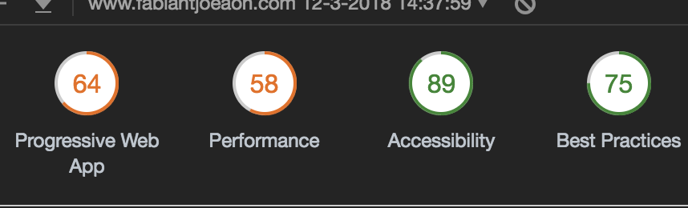
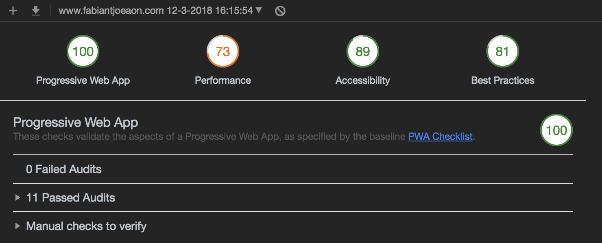

## Progressive Web Apps

<a href="https://developers.google.com/web/ilt/pwa/why-build-pwa" target="_blank">Progressive Web Apps</a>, or PWA's for short, take advantage by using the latest technologies by combining the best of mobile and web apps. Your website can be called a PWA whenever it ticks all the boxes on <a href="https://developers.google.com/web/progressive-web-apps/checklist" target="_blank">this checklist.</a>

## Gatsby
This portfolio was build using <a href="https://www.gatsbyjs.org/" target="_blank">Gatsby.js</a>. Gatsby is a PWA generator, meaning it generates your static site with the needed Google Lighthouse requirements to have your website be a PWA, when configured correctly. It does this by adding Server Side rendering by default, optimizing your assets through a pre configured Webpack configuration, and more.

However, that doesn't mean you instantly have a PWA. To have your site work offline, generate the right resources during the build process (like a manifest, favicons etc), you need to do a lot of configuration yourself.

## Meetings requirements

During the development of my portfolio, I kept the following things in my implementation, mostly thanks to useful plugin withing the Gatsby and React ecosystem:

- I've used a CSS-in-JS solution to have my component-related styles only loaded when necessary, which is, whenever my component is needed on a page. In this case I always use <a href="https://www.styled-components.com/">Styled Components</a>. I also managed to split my globally injected CSS across pages, and optimized the workflow in Gatsby by installing the `gatsby-plugin-styled-components` plugin.
- I generated favicons in an early process, using `gatsby-plugin-favicon`, which generates favicons for every situation during the build process. Think a favicon in muliple sizes of the power by two (16x16, 32x32), but also icons for use on the homescreen on IOS and Android.
- My blog posts are written in Markdown, and then processed to static HTML using `gatsby-transformer-remark`, which, in turn uses <a href="https://github.com/remarkjs/remark" target="_blank">remark</a>. Attachments for these posts are not instantly optimized, and `gatsby-remark-images` took care of that for me. Very convenient.
- Instantly serve my site over HTTPS, and force HTTPS on request with <a href="https://www.netlify.com/">Netlify</a>.
- Make my website work offline (`gatsby-plugin-offline`), which takes care of everything you need to do with a Service Worker and more.

I met a score of 64% with a mediocre performance when I build and deployed my portfolio for the first time. 



## Render blocking styles
To fully achieve the 100% for a PWA, I first had to remove stylesheets that are imported through a `<link>` tag in the `<head>`. These cause render blocking, and so it will delay first interactive. Fonts loaded from Google fonts can be loaded in through <a href="https://github.com/typekit/webfontloader" target="_blank">WebFontLoader</a>. At first I've used another Gatsby plugin, called `gatsby-plugin-google-fonts`, but this still loaded fonts through a `<link>` tag. I also got rid of Font Awesome and used optimized inline SVG icons instead.

During the build process, Gatsby uses Server Side Rendering, so the global window object is not present. This formed a problem for packages that make of the global window object, like WebFontLoader in this case. This was solved by putting the WebFontLoader call to the `componentDidMount()` lifecycle, components are not mounted during the build process, almost everything else outside my component is executed. The `import` statement is still present, so I had to overwrite the Webpack configuration during Gatsby's HTML build process, making sure it is processed without a loader:

```javascript
// I got this from a Github issue :)
exports.modifyWebpackConfig = ({ config, stage }) => {
    if (stage === 'build-html') {
      config.loader('null', {
        test: /webfontloader/,
        loader: 'null-loader'
      })
    }
}
```

## Enabling HTTP/2 Server push
Even on the free plan, Netlify lets you use <a href="https://www.smashingmagazine.com/2017/04/guide-http2-server-push/">HTTP/2 Server Push</a>, allowing sending assets to the user before they have asked for them, when you have HTTPS enabled. This can be configured by placing a `_header` file at the root of your project, but this was easily configured using another Gatsby plugin, `gatsby-plugin-netlify`, which took care of this configuration. This increased my render performance.

## 100%
After configuring my manifest, and moving some of my recordings from SoundCloud to MixCloud (the SoundCloud iframe can only be small when you're on a pro account), I finally managed to have a full working Progressive Web App.




Slow server response is mostly the reason of a score of 72% on performance on mobile, sadly. Nonetheless, this setup made my portfolio very fast and accessible in many ways.
