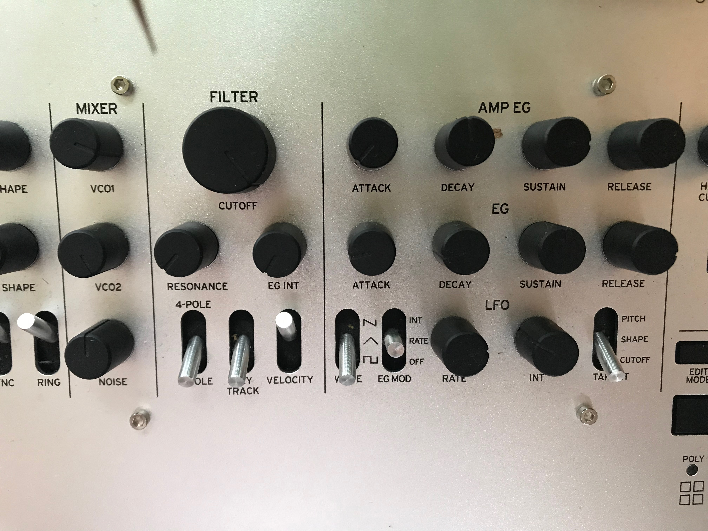
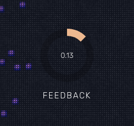

## Banana / gorilla problem

A decent synthesizer with more than 5 modules offers almost infinite possibilities to shape a sound to your liking, which you can achieved by using a complex interface of its own, with mostly knobs, sliders, and switches.

Compared to a user interface on the web, most controls for a synthesizer are not very common. Unlike sliders and switches (which can be easily created through radio buttons), knobs are not so common that they occupate a space in Web UI, and have a custom HTML element. Even though their behaviour is comparable to a slider, I figured I had to create one myself to fully suit the versatility I had in mind when creating a synthesizer interface. I could use a pre-existing solution to a knob element, but I'm not a big fan of pre-made interface libraries, as I think it introduces a form of the Banana / Gorilla problem, which, in its turn, limits you to customizing interface elements to truly suit your design. Though the wheel shouldn't be reinvented, I think when you want to create something that stands out on the web, your options in pre-existing interface libraries are limited, unless you build something reusable by yourself.

## D3

To make my custom knob as responsive as possible I wanted it to have the following functionalities:

1. It should show updated values directly
2. It has to support multiple interactions, in this case both dragging and clicking

The <a href="">D3.js</a> library fits both these use cases for me because I didn't want to style existing HTML elements, it allows me to render SVG based on formulas that remind me of rendering something in WebGL using Three.js. Though I could achieve what I want with basic HTML/CSS or static SVG, animating between a new value and an old one wouldn't be as easy, because D3 allows for very easy interpolation between values. This came with a single caveat however, because I had to pass the rendering process on to D3 instead of React itself (if I wanted React to do it, I had to code the SVG statically inside my `render()`  method), but I figured I could still make use of React's lifecycle hooks on updates.

## Rendering circles
First I layered multiple circles on top of each other, for which the top one would be the one that fills the circle in relation to the current value, and the one in the back is the background. First, to render a circle in D3, you have to create an <a href="http://www.chegg.com/homework-help/definitions/arc-of-a-circle-63">arc</a>:

```javascript
this.arc = d3
    .arc()
    .innerRadius(innerRadius)
    .outerRadius(outerRadius)
    .startAngle(0);
```

To render the front circle representing the current value, it should stop at a satured value between 0 and 100, which is the current value for this parameter 
When we multiply this by <a href="http://math.wikia.com/wiki/Tau_(constant)">Tau</a>, we render a donut that's not all the way through, like the background.

```javascript
// Donut is the main container
this.foreground = donut
    .append('path')
    .datum({
        endAngle: saturatedValue * this.tau
    })
    .style('fill', `rgba(${colors.primary}, 1)`)
    .attr('d', this.arc);
```
<br>
Which resulted in the following knob:
<br/>
<br/>

<br>

## Clicking mechanism

Both the dragging and clicking interactions are implemented. I'll discuss the clicking mechanism here, to have a look at the dragging mechanism, please check out my <a href="https://github.com/fabiantjoeaon/sound-shapes">Github</a>

When clicked on the donut of my knob, I want to know the value that is desired, knowing that my circle spans all the values from the parameter's minimum until maximum. Knowing that the mouse will land somewhere on the 360 degrees of my donut, I can figure out what value will correspond to that location by calculating the percentage.

```javascript
    // Helper method I found on internet that calculates a 360 degrees angle based on an x and y position
    const calculateAngle = (x, y) => {
        const k = Math.abs(y) / Math.abs(x);
        let angle = Math.atan(k) * 180 / Math.PI;
        if (y * x > 0) {
            angle = 90 - angle + (y < 0 ? 180 : 0);
        } else {
            angle = angle + (y < 0 ? 90 : 270);
        }

        return angle;
    };

    handleDonutMouseClick = mouse => {
        // Calculate angle clicked,
        // the calculateMouseAngle function implements the calculateAngle above
        // by deconstructing the D3 mouse event object
        const angle = this.calculateMouseAngle(mouse);

        // Saturate this value between 0 and 100
        const percentageFromAngle = saturatePercentage(0, 360, angle);

        /**
         * Calculate the total available values going
         * from min to max (for -100 to 100 this would be 200)
         */
        const total =
            this.props.min < 0
                ? this.props.max + Math.abs(this.props.min)
                : this.props.max - this.props.min;

        // Then from this total, get the desired value 
        const calculatedValueFromPercentage =
            percentageFromAngle * (total / 100);

        // If min is under 100 it should be added from there and not from zero
        const value = this.props.min + calculatedValueFromPercentage;

        // Dispatch action and update the store
        this.props.setParameter(this.props.module, this.props.param, value);
    };
```

## Updating accordingly on store updates
Then later, whenever the store state updates for this parameter changes, a re-render is triggered, and I can make use of React's `componentWillUpdate()` lifecycle hook to update the new value, which in turn animates the current value text that's inside my knob, and the front-circle updates accordingly.

```javascript
    // Only re-render when the value for this parameter has changed
    shouldComponentUpdate(nextProps, nextState) {
        return nextProps.value !== this.props.value;
    }

    updateKnob(saturatedValue, { value }) {
        const self = this;
        this.foreground
            .transition()
            .duration(900)
            .ease(d3.easePolyOut)
            .attrTween('d', d => {
                const interpolate = d3.interpolate(
                    d.endAngle,
                    saturatedValue * this.tau
                );

                return t => {
                    d.endAngle = interpolate(t);
                    return this.arc(d);
                };
            });

        this.valueEl
            .transition()
            .duration(850)
            .ease(d3.easeSinOut)
            .tween('text', function() {
                // A function to cut my floating point value to 2 0's behind the decimal
                const nextValue = self.fixFloatValue(value);
                const interpolate = d3.interpolate(this.textContent, nextValue);
                const prec = (nextValue + '').split('.');
                const round =
                    prec.length > 1 ? Math.pow(10, prec[1].length) : 1;

                return t => {
                    this.textContent =
                        Math.round(interpolate(t) * round) / round;
                };
            });
    }

    componentWillUpdate(nextProps, nextState) {
        this.updateKnob(
            // Method to saturate value to floating point value between 1 and 0
            saturateZeroOne(this.props.min, this.props.max, nextProps.value),
            nextProps
        );
    }
```
<br>
The result:

<video muted autoplay loop>
  <source src="./knob-animated.mp4" type="video/mp4">
  
  Your browser does not support the video tag.
</video>

