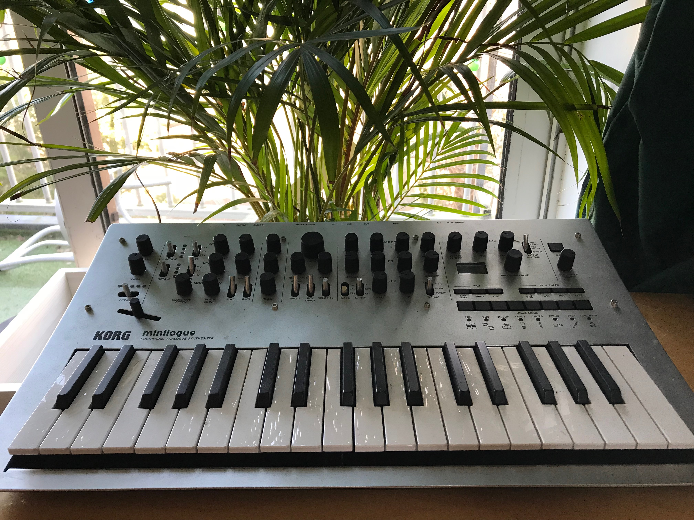

<strong>This project is not finished yet, but you can already play around with it <a target="_blank" href="https://fabiantjoeaon.github.io/sound-shapes">here</a>.</strong>
<br><br>
This is a spare-time project of mine, where I explored the possibilities of visualising synthesizer parameters with WebGL.
The synthezier itself is build using React and Redux. 

<video muted autoplay loop>
  <source src="./synth.mp4" type="video/mp4">
  
  Your browser does not support the video tag.
</video>


I've used CSS Grid and D3.js to realise a complex layout that resembles a real life synthesizer, which is based on my Korg Minilogue I have at home.

Due to the modular nature of synthesizers, I tried utilising the component based style of React to its full potential, making every module a seperate component, which I could easily position in my grid by passing it a set of columns and rows. Here is an example of a module:


```javascript
<Oscillator
    gridColumns="1 / span 1"
    gridRows="1 / span 2"
    oscillator={synth.oscillatorA}
    setParameter={setParameter}
    oscillatorId="A"
    settings={config.oscillators}
/>
```

<br>

One reason I have used Redux for this project is not only to manage a large set of state, but also to extract my state to a higher level, so that I can seperate my WebGL code, and subscribe to store updates in WebGL, so that I can visualize something whenever a parameter is changed.

<br>


Note the settings prop in the code block above. By abstracting my configuration for my synth parameters to a custom object, my min and max values can be edited with ease:

```javascript
  const config = {
    master: {
        volume: {
            min: -80,
            max: 5
        },
        pitch: {
            options: [...5]
        },
        transport: {
            min: 20,
            max: 200
        }
    },
    oscillators: {
        type: {
            options: [
                'sine', 'triangle', 'sawtooth', 'square'
            ]
        },
        detune: {
            min: -100,
            max: 100
        },
        phase: {
            options: ['0', '45', '90', '180']
        }
    },
    // and so on...
```
<br/>
Relevant blog posts:
<br/>
<br/>
<div>
    <a href="/blog/building-my-web-synth--rendering-knobs">Rendering responsive synthesizer knobs using React and D3</a>
</div>
<br/>
<div>
    <a href="/blog/building-my-web-synth--handling-octaves"> Handling octaves with Redux </a>
</div>


